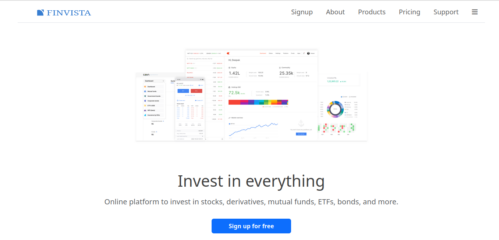
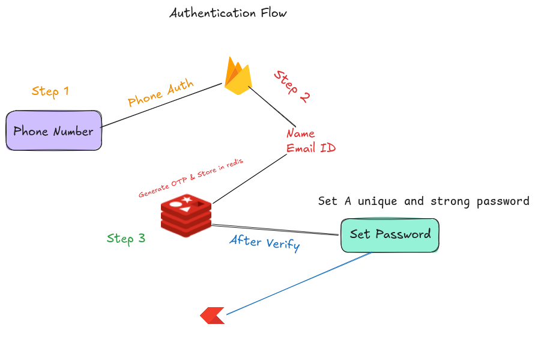

# FinVista 📈

FinVista is a meticulously crafted web application that emulates the sophisticated and clean user interface of leading financial technology (fintech) platforms. This project is a hands-on demonstration of my full-stack development capabilities, focusing on a multi-layered authentication flow, real-time data handling, and a high-fidelity, dynamic user experience.



**Live Demo:** `<url>`


## Table of Contents
-   **[Project Overview](#project-overview)**
-   **[Key Features](#-key-features)**
-   **[Authentication Flow](#-authentication-flow-a-detailed-walkthrough)**
-   **[Tech Stack](#-tech-stack)**
-   **[Project Structure](#-frontend-project-structure)**
-   **[Getting Started](#getting-started)**
-   **[Dashboard Repository](#dashboard-repository)**
-   **[Backend Repository](#backend-repository)**
-   **[⚠️ Important Note](#️-important-note-on-phone-authentication-testing)**

### Project Overview  

**FinVista** is a robust trading platform clone designed to simulate the core functionalities of a **real-world stock trading application**, with a strong emphasis on a **secure** and **multi-step user authentication process**. It provides users with a **comprehensive dashboard** to track a personalized watchlist and analyze stock performance through interactive charts. The project showcases my ability to architect a **complex user registration journey**, **integrate multiple services** *(Firebase and Redis)*, and manage a **full-stack application from development to deployment**.  

### ✨ Key Features

-   **Multi-Step User Authentication:** _A highly secure and robust signup process that involves multiple verification steps to ensure user authenticity._  
-   **Market Watchlist:** _Real-time stock price updates for user-selected scrips, powered by a dynamic data fetching mechanism._
-   **Interactive Charting:** _Interactive charts to analyze stock performance, providing users with a detailed visual overview of market trends._  

### 🔒 Authentication Flow: A Detailed Walkthrough  

The user signup process is a key feature of this project, designed to be both secure and user-friendly. The flow is a three-stage, two-factor authentication journey: 

1. **Phone Number Verification:**
    - The user initiates the signup process by entering their phone number.
    - A one-time password (OTP) is sent to the provided number via Firebase Authentication. This step immediately verifies the user's phone ownership.  

2. **Email and Name Registration:**
    - After successful phone verification, the user is prompted to enter their name and email address.
    - A new OTP is sent to the registered email address for a second layer of authentication. This step ensures the email is valid and provides a secondary contact for the user.

3. **Password Creation & Account Finalization:**
    - Once the email OTP is validated, the user is redirected to a final form to set a secure password.
    - Upon setting the password, the user's account is successfully created. Their details are securely stored, and a user session is initiated.



### 💻 Tech Stack

This project is built with a modern and comprehensive full-stack architecture:

**Frontend**

-   **ReactJS :** The core of the application's user interface, leveraging a component-based architecture for modular, reusable, and scalable code.
-   **Bootstrap :** Utilized for its powerful responsive grid system and pre-built components, ensuring a visually consistent and mobile-friendly design.
-   **Tailwind CSS :** Used for advanced, utility-first styling to achieve a polished, pixel-perfect look that mirrors industry-standard designs.
-   **JavaScript :** Powers all interactive elements and dynamic content, providing a smooth and engaging user experience.

**Backend**

-   **Node.js :** The JavaScript runtime environment that provides a scalable and high-performance backend.
-   **Express.js :** A minimal and flexible Node.js web application framework used to build robust API endpoints and manage server-side logic.
-   **MongoDB :** A powerful NoSQL database used for flexible and scalable data storage, including user profiles, watchlists, and other application data.
-   **Mongoose :** An Object Data Modeling (ODM) library for MongoDB and Node.js, providing a straightforward way to interact with the database.
-   **Firebase Authentication :** A highly secure and easy-to-use authentication service that handles the critical SMS and email OTP verification steps, ensuring a robust and reliable user sign-in process.
-   **Redis DB :**  An in-memory data store used for caching and managing short-lived data, such as OTPs and temporary session tokens, significantly improving authentication speed and overall performance.  

### 📂 Frontend Project Structure  
```
📁 trading-platform
├── 📁 node_modules
├── 📁 public
├── 📁 src
│   ├── 📁 landing_page
│   │   ├── 📁 about
│   │   ├── 📁 AccountActive
│   │   ├── 📁 home
│   │   ├── 📁 pricing
│   │   ├── 📁 products
│   │   ├── 📁 signup
│   ├── 📁 support
│   │   ├── Footer.js
│   │   ├── Navbar.js
│   │   ├── OpenAccount.js
│   │   ├── ScrollToTop.js
│   │   ├── TitleSetter.js
│   ├── firebase.js
│   ├── index.css
│   ├── index.js
│   ├── Layout.js
│   ├── NotFoundPage.js
│   ├── reportWebVitals.js
│   ├── setupTests.js
├── .env
├── .gitignore
├── package.json
├── package-lock.json
└── README.md
```

### 🚀 Getting Started 
Follow the following lines for running the project locally.  

1. **Clone The Repository**
```
https://github.com/Afzal14786/Trading-Platform.git
cd Trading-Platform
```

2. **Install Dependencies**
```
npm install
```

3. **Set Up Environment Variables**
Create a .env file in the root directory and add the necessary environment variables. Here's an example structure:
```
REACT_APP_FIREBASE_API_KEY=your_api_key
REACT_APP_FIREBASE_AUTH_DOMAIN=your_auth_domain
REACT_APP_FIREBASE_PROJECT_ID=your_project_id
REACT_APP_FIREBASE_STORAGE_BUCKET=your_storage_bucket
REACT_APP_FIREBASE_MESSAGING_SENDER_ID=your_sender_id
REACT_APP_FIREBASE_APP_ID=your_app_id
REACT_APP_BACKEND_URL=http://localhost:5000
```
> ⚠️ Replace the values with your actual Firebase and backend credentials.

4. **Start the Development Server**
```
npm run dev
```

### 🧩 Dashboard Repository  
The **Dashboard Repository** contains the core authenticated user experience of the platform. Once users complete the multi-step signup and verification process on the FinVista landing page (this repository), the user redirected to the dashboard, where user can:
-   Search Strocks and place order
-   Manage their personal watchlist
-   Access detailed analytics on selected stocks
-   Navigate through a secure and responsive UI built specifically for active users  

**📁 Repository Link:** _**[Dashboard Repository](https://github.com/Afzal14786/trading-dashboard.git)**_

The dashboard is developed as a standalone **React application** to ensure **modularity** and **easier scaling** of features independently from the landing and onboarding flow.

### 🛠️ Backend Repository  
The **Backend Repository** powers all server-side operations and API endpoints required by both the landing page and dashboard. It is responsible for:
-   User authentication logic (phone/email OTP verification)
-   User data management (profiles, sessions, passwords)
-   Watchlist CRUD operations
-   Integration with Firebase for authentication
-   Use of Redis for caching OTPs and handling temporary session data
-   MongoDB for persistent storage

**📁 Repository Link:** _**[Backend Repository](https://github.com/Afzal14786/zerodha-backend.git)**_  

The backend is built with **Node.js**, **Express.js**, **MongoDB**, **Firebase**, and **Redis**, forming a _robust_ and _scalable service layer_ for the **FinVista ecosystem**.  

**** 

### ⚠️ Important Note on Phone Authentication Testing  

This project implements **phone number authentication using Firebase** as part of its secure multi-step signup flow.  

However, due to Firebase's requirement for a valid billing account (credit/debit card) to enable unrestricted phone authentication in live environments, **I am currently unable to offer real-time phone verification using random test numbers.**  

To ensure you can still **test the phone authentication flow**, I’ve configured multiple test phone numbers within Firebase that simulate real OTP-based login. These numbers allow developers to experience the complete authentication process **without requiring a credit/debit card or real SMS delivery**.  

> ⚠️ **Important:**  
> The phone numbers listed below are **randomly generated by an AI language model (ChatGPT)** for development purposes only.  
> They are not owned or associated with me (the repository maintainer).  
> These numbers are registered in Firebase as test credentials and will not trigger actual SMS or incur any cost.  


**Use the following 📱numbers and OTPs for testing:**  

| S.No | Phone Number     | OTP     | Status        |
|------|------------------|---------|----------------|
| 1    | +917012345678    | 111222  | ✅ Available   |
| 2    | +919876543210    | 654321  | ✅ Available   |
| 3    | +911234567890    | 995511  | ✅ Available   |
| 4    | +918001122334    | 222333  | ✅ Available   |
| 5    | +917890123456    | 333444  | ✅ Available   |
| 6    | +916543219876    | 444555  | ✅ Available   |
| 7    | +917700880099    | 555666  | ✅ Available   |
| 8    | +918888777666    | 666777  | ✅ Available   |
| 9    | +919999000111    | 777888  | ✅ Available   |
| 10    | +919955118287    | 123456  | ❌ Used   |  

> Use only `10 digit number`, exculde `+91`

### 📋 How to Use the Test Phone Authentication  
To test the phone authentication feature in the signup flow, follow these steps:  

1. **🚀 Go to the Signup Page**  
Navigate to the signup page in your app.  

2. **📱 Enter a Test Phone Number**  
Enter any one of the available test phone numbers from the list above into the phone number input field.  

3. **📩 Receive OTP Prompt**  
You’ll see a message:  
_“An OTP has been sent to your mobile number.”_  

4. **🔢 Enter the Test OTP**  
Instead of a real SMS, enter the corresponding OTP from the table above for the phone number you used.  

5. **✅ OTP Verification & Navigation**  
Once the OTP is verified, you’ll be automatically taken to the next step of the signup flow.  

---

### 🚨 Having Trouble Creating an Account?

If all the test phone numbers are already registered and you're unable to create a new account, don’t worry — just **reach out to me directly** and I’ll help you out by clearing an existing test account so you can proceed.

You can contact me via:

- 📧 **Email :** [mdafzal14777@gmail.com](mailto:mdafzal14777@gmail.com)  
- 📸 **Instagram :** [@afzal14786](https://instagram.com/afzal14786)

---

### ⭐ Like This Project?

If you found this project helpful, informative, or fun to work with:

- Give it a **🌟 star** on [GitHub](https://github.com/afzal14786)  
- **Follow me** for more cool projects and updates:
  - 🐙 [GitHub](https://github.com/afzal14786)
  - 🔗 [LinkedIn](https://linkedin.com/afzal14786)
  - 📸 [Instagram](https://instagram.com/afzal14786)
  - 📘 [Facebook](https://facebook.com/afzal14786)
  - 💼 [LinkedIn](https://www.linkedin.com/in/afzal14786)


---

Thank you for your support — Happy Coding! 🚀👨‍💻✨
